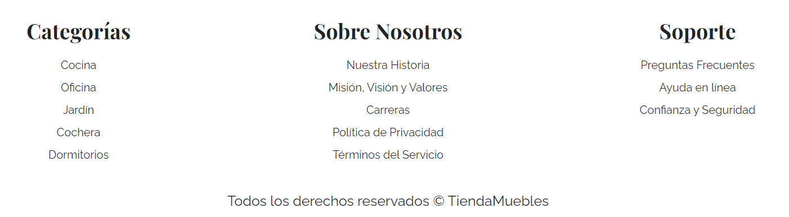

# Sitio web para tienda de muebles (Responsive)

Este proyecto es el diseño de una página web adaptable a dispositivos de distintos tamaños (este tipo de sitio web se conoce en inglés como "responsive").

Incluye diferentes apartados como:

- Inicio
- Nosotros
- Tienda
- Blog
- Galería
- Contacto

Por ahora los apartados de "*Categorías*", "*Sobre Nosotros*" y "*Soporte*" son sólo guías visuales, los enlaces están deshabilitados.

## Funcionamiento:
[TiendaMuebles](https://la-tienda-de-muebles.netlify.app/)

## Tecnologías
- HTML5
- CSS3
- JavaScript
- Bootstrap 5

Además, se incluyeron **Google Fonts** para personalizar la fuente y **Pexels** para incorporar imágenes.
